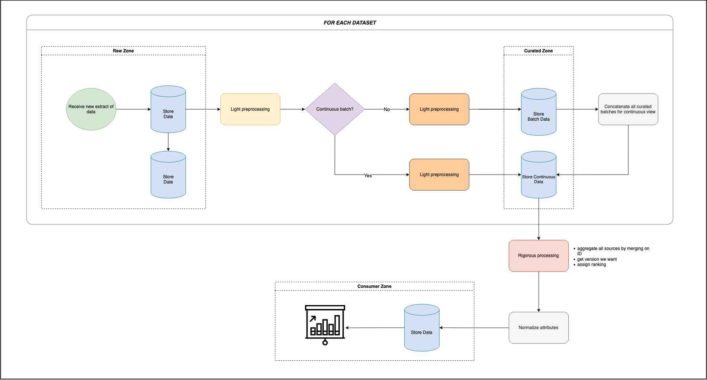

<h1 align="center"> PROJECT NAME </h1>
<h3 align="center"> ONE LINER ABOUT PROJECT NAME </h3>  

</br>

<p align="center"> 
  
</p>

<!-- TABLE OF CONTENTS -->
<h2 id="table-of-contents"> :book: Table of Contents</h2>

<details open="open">
  <summary>Table of Contents</summary>
  <ol>
    <li><a href="#about-the-project"> ➤ About The Project</a></li>
    <li><a href="#prerequisites"> ➤ Prerequisites</a></li>
    <li><a href="#folder-structure"> ➤ Folder Structure</a></li>
    <li><a href="#datasets"> ➤ Datasets</a></li>
    <li><a href="#how-it-works"> ➤ How It Works</a></li>
    <li>
      <a href="#preprocessing"> ➤ Preprocessing</a></li>
      </ul>
    </li>
    <!--<li><a href="#experiments">Experiments</a></li>-->
    <li><a href="#results-and-impact"> ➤ Results and Impact</a></li>
    <li><a href="#contributors"> ➤ Contributors</a></li>
  </ol>
</details>

-----

<!-- ABOUT THE PROJECT -->
<h2 id="about-the-project"> :pencil: About The Project</h2>

<p align="justify"> 
  INSERT STUFF HERE!!!!!!
</p>

-----
<!-- PREREQUISITES -->
<h2 id="prerequisites"> :fork_and_knife: Prerequisites</h2>

<!--This project is written in Python programming language. <br>-->
The following open source packages are used in this project:
* Numpy
* Pandas
* INSERT STUFF HERE!!!!!!

-----
<!-- FOLDER STRUCTURE -->
<h2 id="folder-structure"> :cactus: Folder Structure</h2>

    code
    .
    │
    ├── data
    │   ├── raw
    │   │   ├── source N1
    │   │   │   ├── ???
    │   │   │   └── ???
    │   │   ├── source N2
    │   │       ├── ???
    │   │       └── ???
    │   │
    │   ├── processed
    │   │   ├── source N1
    │   │   │   ├── ???
    │   │   │   └── ???
    │   │   ├── source N2
    │   │       ├── ???
    │   │       └── ???
    │   │
    │   ├── sources
    │       ├── feature_phone_accel
    │       ├── feature_phone_gyro
    │       ├── feature_watch_accel
    │       ├── feature_watch_gyro
    │   
    │
    ├── CNN_Impersonal_TransformedData.ipynb
    ├── CNN_Personal_TransformedData.ipynb  
    ├── Topological data analysis.ipynb  

-----
<!-- DATASET -->
<h2 id="datasets"> :floppy_disk: Datasets</h2>
<p> 

INSERT TABLE HERE!!!!!!!

</p>

<!-- <p align="center">
  
</p> -->

-----

<!-- HOW IT WORKS -->
<h2 id="how-it-works"> :dart: How It Works</h2>

<p align="justify"> 
<p align="center">
  
</p>
  

-----
<!-- PREPROCESSING -->
<h2 id="preprocessing"> :hammer: Preprocessing</h2>

<p align="justify"> 

  In this project we have three different data zones, which are as follows: 
  <ol>
    <li><b>Raw zone:</b> data in its raw form</li> 
    <li><b>Curated zone</b></li>    
    <li><b>Consumption zone</b></li>
  </ol>
  <p align="justify"> 
  
  
  All these datasets used fuzzy sock technique to match the raw data features to attributes in another datasets. The techique then assigned a confidence score that looks like this:
  </p>
</p>

    
<!-- <details><summary><b>Show instructions</b></summary>

1. Install the preset:

    ```sh
    $ npm install --save-dev size-limit @size-limit/file
    ```

2. Add the `size-limit` section and the `size` script to your `package.json`:

    ```diff
    + "size-limit": [
    +   {
    +     "path": "dist/app-*.js"
    +   }
    + ],
      "scripts": {
        "build": "webpack ./webpack.config.js",
    +   "size": "npm run build && size-limit",
        "test": "jest && eslint ."
      }
    ```

</details> -->

-----

<!-- RESULTS AND IMPACT -->
<h2 id="results-and-impact"> :mag: Results and Impact</h2>

<p align="justify">
<ul>
  <li>
    EXAMPLE 1
  <li>
    EXAMPLE 2
  </li>
</ul>
</p>

-----

<!-- CONTRIBUTORS -->
<h2 id="contributors"> :scroll: Contributors</h2>

<p>
  :desktop_computer: <i>All participants in this project are graduate students in the XYZ.</i> <br>
  
  :wave: <b>NAME 1</b> <br>
  &nbsp;&nbsp;&nbsp;&nbsp;&nbsp; Email: <a>EMAIL1</a> <br>
  &nbsp;&nbsp;&nbsp;&nbsp;&nbsp; GitHub: <a href="GITHUBLINK.COM">GUTHUB</a> <br>
  
</p>
